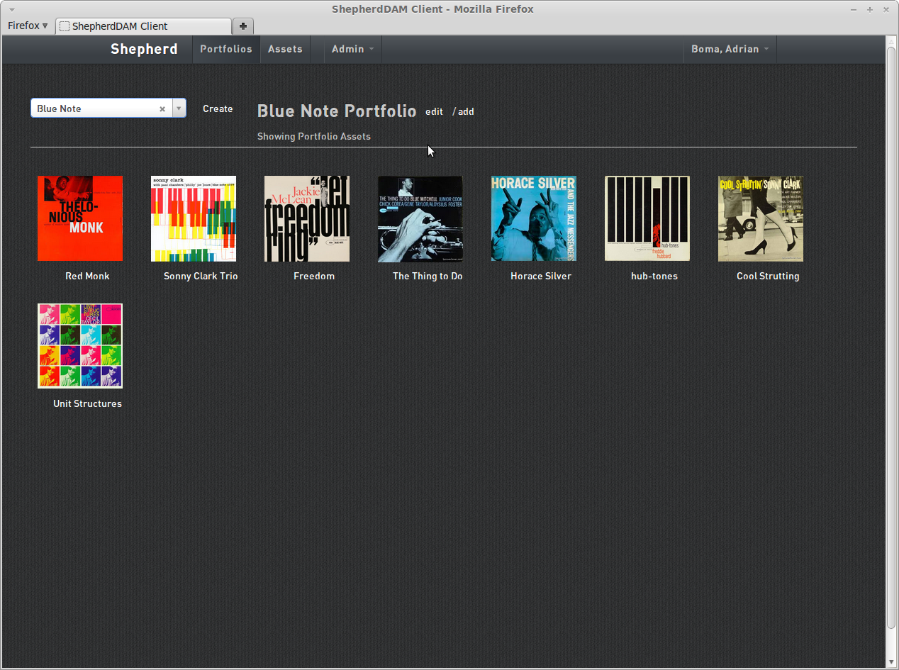

# Shepherd Ember.js Client Application

Shepherd Ember.js Client is a client application for the [Shepherd Document Asset Management (DAM) server API](https://github.com/aboma/shepherd-rest-api) for storing and serving media files with associated metadata. It uses [ember.js](http://emberjs.com/) to provide a superior user experience using a one-page web application.

## Why Another Digital Asset Management System?

Shepherd allows you to have one canonical version of a file that can be shown through many containers (portfolios). Most other systems require you to save a copy of the file in each container, which leads to unnecessary storage and divergence of metadata.

Shepherd also separates the client frontend application from the backend RESTful server, allowing you the flexibility to build your own client app using your preferred technology or merely interface the API with other systems without using a frontend.

This client application has also been designed for superior responsiveness and usability achieved through the use of a one page javascript app.



## Releases

Please see the Changelog for complete release information.

## Roadmap

* Search
* Video and document support
* User Permissions
* Results Paging

## Installation

### Environment

It is recommended that you install this application on Linux. It has been tested on Ubuntu Linux.

### Pre-requisites

Ruby, Bundler gem, ImageMagick dev package

### Process

* Install Shepherd REST API server
* Checkout lastest release using git tags: clone the repository and then checkout the release tag that you have selected:

```
$ git clone git@github.com:aboma/shepherd-emberjs-client.git 
$ git checkout tags/<tag_name>
```

* Set protocol, host, port and path settings to Shepherd REST API server in `config/setting.yml` or `config/settings/<environment>.yml` files. If these settings are not there or incorrect, upon login a message will state that the system is unable to contact API.

## Contributing

Contributions welcome and appreciated.
